# Contributing
Thank you very much for your interest in contributing to the improvement of **Simple-OpenAI**. Please, follow the next guidelines.

## General Guidelines
1. Keep the code compatible with Java 11.
1. Follow existing code styles present in the project.
1. Avoid adding new dependencies as much as possible.
1. Ensure to add Javadoc where necessary.
1. Provide unit tests for your code.
1. Provide demo code to use real services. Use environment variables for credentials.
1. Large features should be discussed with maintainers before implementation. Use the [Discussion](https://github.com/sashirestela/simple-openai/discussions) section for this.

## Code Formatting
This project is configured with [Spotless](https://github.com/diffplug/spotless/tree/main/plugin-maven) to automatically check code formatting against a [custom code format](codestyle/spotless_java_eclipseformat.xml) specification of modern Java, as well as [import order](codestyle/spotless_java.importorder).

Spotless comes with two Maven commands that you can run at any moment, preferably before committing your changes:

- `mvn spotless:check`, to verify if code is formatted correctly.
- `mvn spotless:apply`, to rewrite the source code in place.

The remote build will check the code formatting, so the build will fail if the code isn't formatted correctly.

## Configure IDE (Optional)
You could set your favorite IDE to be aligned to the custom code format. See details below.

<b>IntelliJ</b>

1. Import the custom code format:

2. Select the file on _codestyle/spotless_java_eclipseformat.xml_:

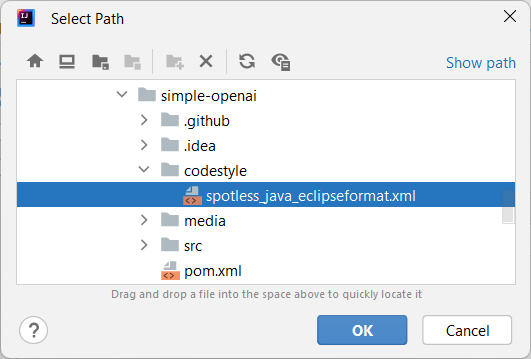

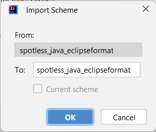

3. In the _Imports_ section, change the values as in the image:

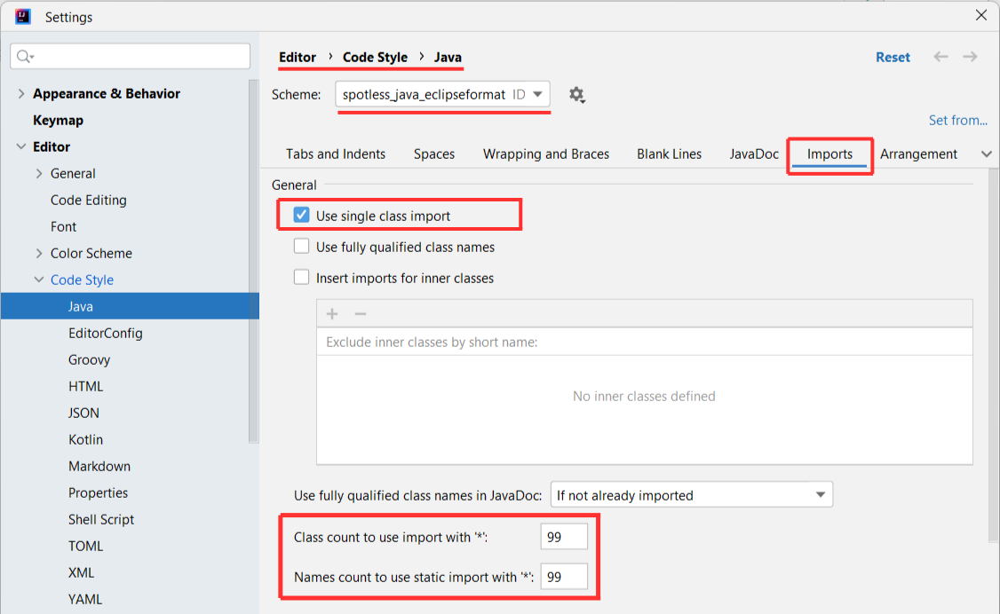

4. At the bottom part in the _Imports_ section, change the _import statement order_ as in the image:

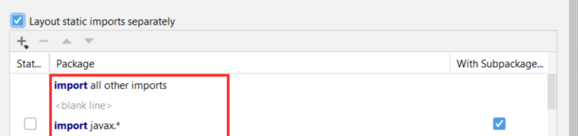

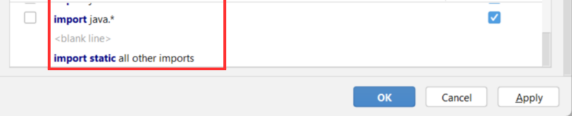

<b>VSCode</b>

1. Install the extension _Language Support for Java by Red Hat_:

2. Set the custom code format using the value _codestyle/spotless_java_eclipseformat.xml_:

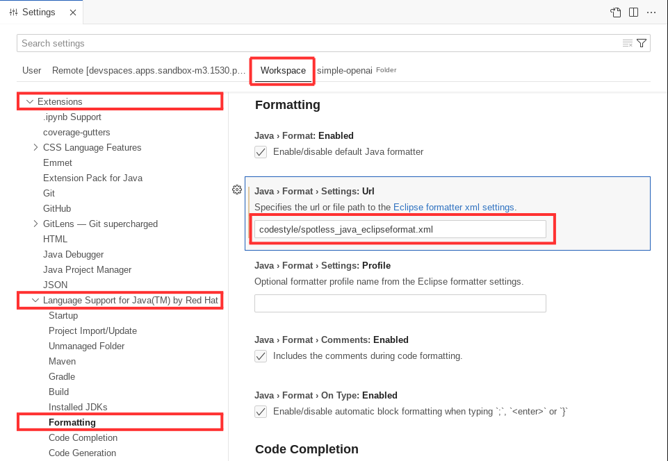

3. Configure the _Import Order_ by clicking in the link:

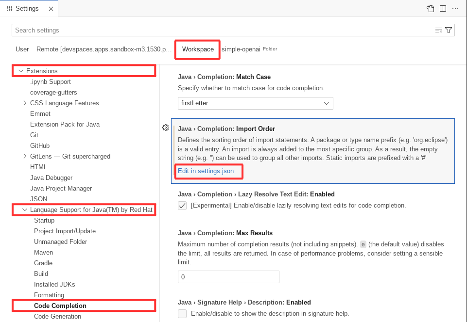

4. Set the _import statement order_ as in the image:

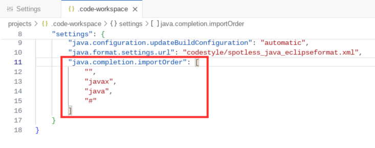

<b>Eclipse</b>

1. Import the custom code format:

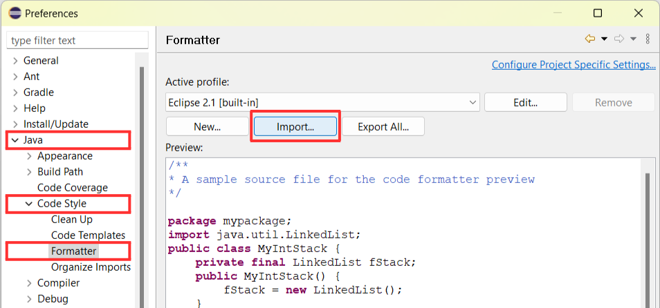

2. Select the file on _codestyle/spotless_java_eclipseformat.xml_:

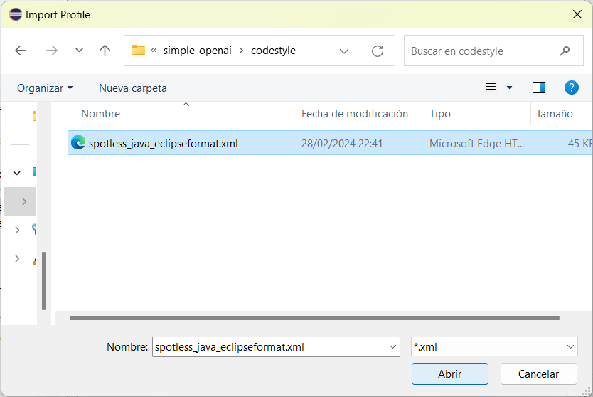

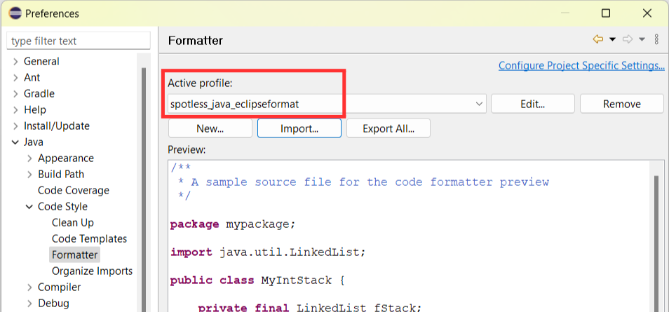

3. Import the custom import statement order:

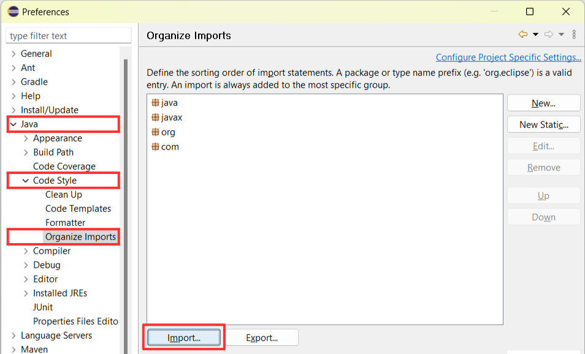

4. Select the file on _codestyle/spotless_java.importorder_:

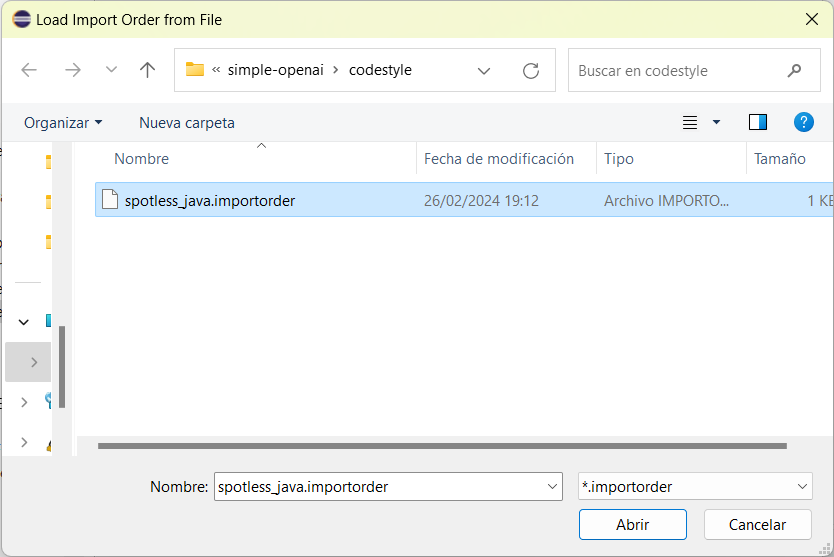

5. In the _Organize Imports_ section, make sure you see the values as in the image:

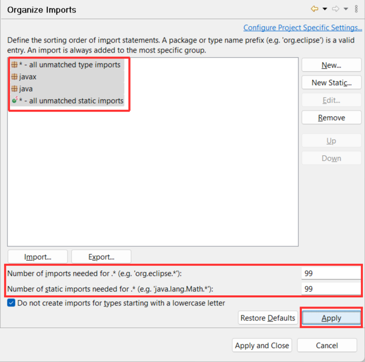

