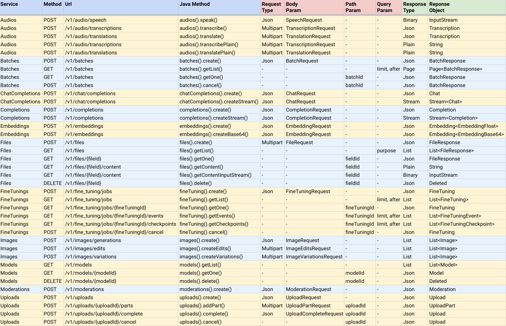

# 📌 Simple-OpenAI
A Java library to use the OpenAI Api in the simplest possible way.

[](https://sonarcloud.io/summary/new_code?id=sashirestela_simple-openai)
[](https://codecov.io/gh/sashirestela/simple-openai)


[](https://javadoc.io/doc/io.github.sashirestela/simple-openai/latest/index.html)


### Table of Contents
- [Description](#-description)
- [Supported Services](#-supported-services)
- [Installation](#-installation)
- [How to Use](#-how-to-use)
  - [Creating a SimpleOpenAI Object](#creating-a-simpleopenai-object)
  - [Using HttpClient or OkHttp](#using-httpclient-or-okhttp)
  - [Using Realtime Feature](#using-realtime-feature)
  - [Audio Example](#audio-example)
  - [Image Example](#image-example)
  - [Chat Completion Example](#chat-completion-example)
  - [Chat Completion with Streaming Example](#chat-completion-with-streaming-example)
  - [Chat Completion with Functions Example](#chat-completion-with-functions-example)
  - [Chat Completion with Vision Example](#chat-completion-with-vision-example)
  - [Chat Completion with Audio Example](#chat-completion-with-audio-example)
  - [Chat Completion with Structured Outputs](#chat-completion-with-structured-outputs)
  - [Chat Completion Conversation Example](#chat-completion-conversation-example)
  - [Assistant v2 Conversation Example](#assistant-v2-conversation-example)
  - [Realtime Conversation Example](#realtime-conversation-example)
- [Exception Handling](#-exception-handling)
- [Retrying Requests](#-retrying-requests)
- [Instructions for Android](#-instructions-for-android)
- [Support for OpenAI-compatible API Providers](#-support-for-openai-compatible-api-providers)
  - [Gemini Vertex API](#gemini-vertex-api) **NEW**
  - [Gemini Google API](#gemini-google-api)
  - [Deepseek API](#deepseek-api)
  - [Mistral API](#mistral-api)
  - [Azure OpenAI](#azure-openai) **UPDATED**
  - [Anyscale](#anyscale)
- [Run Examples](#-run-examples)
- [Contributing](#-contributing)
- [License](#-license)
- [Who is Using Simple-OpenAI?](#-who-is-using-simple-openai)
- [Show Us Your Love](#-show-us-your-love)


## 💡 Description
Simple-OpenAI is a Java http client library for sending requests to and receiving responses from the [OpenAI API](https://platform.openai.com/docs/api-reference). It exposes a consistent interface across all the services, yet as simple as you can find in other languages like Python or NodeJs. It's an unofficial library.

Simple-OpenAI uses the [CleverClient](https://github.com/sashirestela/cleverclient) library for http communication, [Jackson](https://github.com/FasterXML/jackson) for Json parsing, and [Lombok](https://projectlombok.org/) to minimize boilerplate code, among others libraries.


## ✅ Supported Services
Simple-OpenAI seeks to stay up to date with the most recent changes in OpenAI. Currently, it supports most of the existing features and will continue to update with future changes.

Full support for most of the OpenAI services:

* Audio (Speech, Transcription, Translation)
* Batch (Batches of Chat Completion)
* Chat Completion (Text Generation, Streaming, Function Calling, Vision, Structured Outputs, Audio)
* Completion (Legacy Text Generation)
* Embedding  (Vectoring Text)
* Files (Upload Files)
* Fine Tuning (Customize Models)
* Image (Generate, Edit, Variation)
* Models (List)
* Moderation (Check Harmful Text)
* Realtime Beta (Speech-to-Speech Conversation, Multimodality, Function Calling)
* Session Token (Create Ephemeral Tokens)
* Upload (Upload Large Files in Parts)
* Assistants Beta v2 (Assistants, Threads, Messages, Runs, Steps, Vector Stores, Streaming, Function Calling, Vision, Structured Outputs)




NOTES:
1. The methods's responses are `CompletableFuture<ResponseObject>`, which means they are asynchronous, but you can call the join() method to return the result value when complete.
1. Exceptions for the above point are the methods whose names end with the suffix `AndPoll()`. These methods are synchronous and block until a Predicate function that you provide returns false.


## 📝 Installation
You can install Simple-OpenAI by adding the following dependencies to your Maven project:

```xml
<dependency>
    <groupId>io.github.sashirestela</groupId>
    <artifactId>simple-openai</artifactId>
    <version>[simple-openai_latest_version]</version>
</dependency>
<!-- OkHttp dependency is optional if you decide to use it with simple-openai -->
<dependency>
    <groupId>com.squareup.okhttp3</groupId>
    <artifactId>okhttp</artifactId>
    <version>[okhttp_latest_version]</version>
</dependency>
```

Or alternatively using Gradle:

```groovy
dependencies {
    implementation 'io.github.sashirestela:simple-openai:[simple-openai_latest_version]'
    /* OkHttp dependency is optional if you decide to use it with simple-openai */
    implementation 'com.squareup.okhttp3:okhttp:[okhttp_latest_version]'
}
```
Take in account that you need to use Java 11 or greater.


## 📘 How to Use

### Creating a SimpleOpenAI Object
This is the first step you need to do before to use the services. You must provide at least your _OpenAI Api Key_ ([See here](https://platform.openai.com/docs/api-reference/authentication) for more details). In the following example we are getting the Api Key from an environment variable called ```OPENAI_API_KEY``` which we have created to keep it:
```java
var openAI = SimpleOpenAI.builder()
    .apiKey(System.getenv("OPENAI_API_KEY"))
    .build();
```
Optionally you could pass your _OpenAI Organization Id_ in case you have multiple organizations and you want to identify usage by organization and/or you could pass your _OpenAI Project Id_ in case you want to provides access to a single project. In the following example we are using environment variable for those Ids:
```java
var openAI = SimpleOpenAI.builder()
    .apiKey(System.getenv("OPENAI_API_KEY"))
    .organizationId(System.getenv("OPENAI_ORGANIZATION_ID"))
    .projectId(System.getenv("OPENAI_PROJECT_ID"))
    .build();
```
After you have created a SimpleOpenAI object, you are ready to call its services in order to communicate to OpenAI API.

### Using HttpClient or OkHttp
Simple-OpenAI uses one of the following available http client components: [Java's HttpClient](https://docs.oracle.com/en/java/javase/11/docs/api/java.net.http/java/net/http/HttpClient.html) (by default) or [Square's OkHttp](https://square.github.io/okhttp/) (adding a dependency).You can use the ```clientAdapter``` attribute to indicate which to use. In the following example we are providing a custom Java HttpClient:
```java
var httpClient = HttpClient.newBuilder()
    .version(Version.HTTP_1_1)
    .followRedirects(Redirect.NORMAL)
    .connectTimeout(Duration.ofSeconds(20))
    .executor(Executors.newFixedThreadPool(3))
    .proxy(ProxySelector.of(new InetSocketAddress("proxy.example.com", 80)))
    .build();

var openAI = SimpleOpenAI.builder()
    .apiKey(System.getenv("OPENAI_API_KEY"))
    .clientAdapter(new JavaHttpClientAdpter(httpClient))    // To use a custom Java HttpClient
    //.clientAdapter(new JavaHttpClientAdpter())            // To use a default Java HttpClient
    //.clientAdapter(new OkHttpClientAdpter(okHttpClient))  // To use a custom OkHttpClient
    //.clientAdapter(new OkHttpClientAdpter())              // To use a default OkHttpClient
    .build();
```

### Using Realtime Feature
If you want to use the Realtime feature, you need to set the ```realtimeConfig``` attribute. For this feature you will set another http client (similar to ```clientAdapter```) for WebSocket communication: Java's HttpClient (by default) or Square's OkHttp
```java
var openAI = SimpleOpenAI.builder()
    .apiKey(System.getenv("OPENAI_API_KEY"))
    // -- To use a default Java HttpClient for WebSocket
    .realtimeConfig(RealtimeConfig.of("model")
    // -- To use a default Java HttpClient for WebSocket
    //.realtimeConfig(RealtimeConfig.of("model", new JavaHttpWebSocketAdpter())
    // -- To use a custom Java HttpClient for WebSocket
    //.realtimeConfig(RealtimeConfig.of("model", new JavaHttpWebSocketAdpter(httpClient))
    // -- To use a default OkHttpClient for WebSocket
    //.realtimeConfig(RealtimeConfig.of("model", new OkHttpWebSocketAdpter())
    // -- To use a custom OkHttpClient for WebSocket
    //.realtimeConfig(RealtimeConfig.of("model", new OkHttpWebSocketAdpter(okHttpClient))
    .build();
```

### Audio Example
Example to call the Audio service to transform text to audio. We are requesting to receive the audio in binary format (InputStream):
```java
var speechRequest = SpeechRequest.builder()
        .model("tts-1")
        .input("Hello world, welcome to the AI universe!")
        .voice(Voice.ALLOY)
        .responseFormat(SpeechResponseFormat.MP3)
        .speed(1.0)
        .build();
var futureSpeech = openAI.audios().speak(speechRequest);
var speechResponse = futureSpeech.join();
try {
    var audioFile = new FileOutputStream(speechFileName);
    audioFile.write(speechResponse.readAllBytes());
    System.out.println(audioFile.getChannel().size() + " bytes");
    audioFile.close();
} catch (Exception e) {
    e.printStackTrace();
}
```

Example to call the Audio service to transcribe an audio to text. We are requesting to receive the transcription in plain text format (see the name of the method):
```java
var audioRequest = TranscriptionRequest.builder()
        .file(Paths.get("hello_audio.mp3"))
        .model("whisper-1")
        .responseFormat(AudioResponseFormat.VERBOSE_JSON)
        .temperature(0.2)
        .timestampGranularity(TimestampGranularity.WORD)
        .timestampGranularity(TimestampGranularity.SEGMENT)
        .build();
var futureAudio = openAI.audios().transcribe(audioRequest);
var audioResponse = futureAudio.join();
System.out.println(audioResponse);
```
### Image Example
Example to call the Image service to generate two images in response to our prompt. We are requesting to receive the images' urls and we are printing out them in the console:
```java
var imageRequest = ImageRequest.builder()
        .prompt("A cartoon of a hummingbird that is flying around a flower.")
        .n(2)
        .size(Size.X256)
        .responseFormat(ImageResponseFormat.URL)
        .model("dall-e-2")
        .build();
var futureImage = openAI.images().create(imageRequest);
var imageResponse = futureImage.join();
imageResponse.stream().forEach(img -> System.out.println("\n" + img.getUrl()));
```
### Chat Completion Example
Example to call the Chat Completion service to ask a question and wait for a full answer. We are printing out it in the console:
```java
var chatRequest = ChatRequest.builder()
        .model("gpt-4o-mini")
        .message(SystemMessage.of("You are an expert in AI."))
        .message(UserMessage.of("Write a technical article about ChatGPT, no more than 100 words."))
        .temperature(0.0)
        .maxCompletionTokens(300)
        .build();
var futureChat = openAI.chatCompletions().create(chatRequest);
var chatResponse = futureChat.join();
System.out.println(chatResponse.firstContent());
```
### Chat Completion with Streaming Example
Example to call the Chat Completion service to ask a question and wait for an answer in partial message deltas. We are printing out it in the console as soon as each delta is arriving:
```java
var chatRequest = ChatRequest.builder()
        .model("gpt-4o-mini")
        .message(SystemMessage.of("You are an expert in AI."))
        .message(UserMessage.of("Write a technical article about ChatGPT, no more than 100 words."))
        .temperature(0.0)
        .maxCompletionTokens(300)
        .build();
var futureChat = openAI.chatCompletions().createStream(chatRequest);
var chatResponse = futureChat.join();
chatResponse.filter(chatResp -> chatResp.getChoices().size() > 0 && chatResp.firstContent() != null)
        .map(Chat::firstContent)
        .forEach(System.out::print);
System.out.println();
```
### Chat Completion with Functions Example
This functionality empowers the Chat Completion service to solve specific problems to our context. In this example we are setting three functions and we are entering a prompt that will require to call one of them (the function ```product```). For setting functions we are using additional classes which implements the interface ```Functional```. Those classes define a field by each function argument, annotating them to describe them and each class must override the ```execute``` method with the function's logic. Note that we are using the ```FunctionExecutor``` utility class to enroll the functions and to execute the function selected by the ```openai.chatCompletions()``` calling:
```java
public void demoCallChatWithFunctions() {
    var functionExecutor = new FunctionExecutor();
    functionExecutor.enrollFunction(
            FunctionDef.builder()
                    .name("get_weather")
                    .description("Get the current weather of a location")
                    .functionalClass(Weather.class)
                    .strict(Boolean.TRUE)
                    .build());
    functionExecutor.enrollFunction(
            FunctionDef.builder()
                    .name("product")
                    .description("Get the product of two numbers")
                    .functionalClass(Product.class)
                    .strict(Boolean.TRUE)
                    .build());
    functionExecutor.enrollFunction(
            FunctionDef.builder()
                    .name("run_alarm")
                    .description("Run an alarm")
                    .functionalClass(RunAlarm.class)
                    .strict(Boolean.TRUE)
                    .build());
    var messages = new ArrayList<ChatMessage>();
    messages.add(UserMessage.of("What is the product of 123 and 456?"));
    chatRequest = ChatRequest.builder()
            .model("gpt-4o-mini")
            .messages(messages)
            .tools(functionExecutor.getToolFunctions())
            .build();
    var futureChat = openAI.chatCompletions().create(chatRequest);
    var chatResponse = futureChat.join();
    var chatMessage = chatResponse.firstMessage();
    var chatToolCall = chatMessage.getToolCalls().get(0);
    var result = functionExecutor.execute(chatToolCall.getFunction());
    messages.add(chatMessage);
    messages.add(ToolMessage.of(result.toString(), chatToolCall.getId()));
    chatRequest = ChatRequest.builder()
            .model("gpt-4o-mini")
            .messages(messages)
            .tools(functionExecutor.getToolFunctions())
            .build();
    futureChat = openAI.chatCompletions().create(chatRequest);
    chatResponse = futureChat.join();
    System.out.println(chatResponse.firstContent());
}

public static class Weather implements Functional {

    @JsonPropertyDescription("City and state, for example: León, Guanajuato")
    @JsonProperty(required = true)
    public String location;

    @JsonPropertyDescription("The temperature unit, can be 'celsius' or 'fahrenheit'")
    @JsonProperty(required = true)
    public String unit;

    @Override
    public Object execute() {
        return Math.random() * 45;
    }

}

public static class Product implements Functional {

    @JsonPropertyDescription("The multiplicand part of a product")
    @JsonProperty(required = true)
    public double multiplicand;

    @JsonPropertyDescription("The multiplier part of a product")
    @JsonProperty(required = true)
    public double multiplier;

    @Override
    public Object execute() {
        return multiplicand * multiplier;
    }

}

public static class RunAlarm implements Functional {

    @Override
    public Object execute() {
        return "DONE";
    }

}
```
### Chat Completion with Vision Example
Example to call the Chat Completion service to allow the model to take in external images and answer questions about them:
```java
var chatRequest = ChatRequest.builder()
        .model("gpt-4o-mini")
        .messages(List.of(
                UserMessage.of(List.of(
                        ContentPartText.of(
                                "What do you see in the image? Give in details in no more than 100 words."),
                        ContentPartImageUrl.of(ImageUrl.of(
                                "https://upload.wikimedia.org/wikipedia/commons/e/eb/Machu_Picchu%2C_Peru.jpg"))))))
        .temperature(0.0)
        .maxCompletionTokens(500)
        .build();
var chatResponse = openAI.chatCompletions().createStream(chatRequest).join();
chatResponse.filter(chatResp -> chatResp.getChoices().size() > 0 && chatResp.firstContent() != null)
        .map(Chat::firstContent)
        .forEach(System.out::print);
System.out.println();
```
Example to call the Chat Completion service to allow the model to take in local images and answer questions about them (_check the Base64Util's code in this repository_):
```java
var chatRequest = ChatRequest.builder()
        .model("gpt-4o-mini")
        .messages(List.of(
                UserMessage.of(List.of(
                        ContentPartText.of(
                                "What do you see in the image? Give in details in no more than 100 words."),
                        ContentPartImageUrl.of(ImageUrl.of(
                                Base64Util.encode("src/demo/resources/machupicchu.jpg", MediaType.IMAGE)))))))
        .temperature(0.0)
        .maxCompletionTokens(500)
        .build();
var chatResponse = openAI.chatCompletions().createStream(chatRequest).join();
chatResponse.filter(chatResp -> chatResp.getChoices().size() > 0 && chatResp.firstContent() != null)
        .map(Chat::firstContent)
        .forEach(System.out::print);
System.out.println();
```
### Chat Completion with Audio Example
Example to call the Chat Completion service to generate a spoken audio response to a prompt, and to use audio inputs to prompt the model (_check the Base64Util's code in this repository_):
```java
var messages = new ArrayList<ChatMessage>();
messages.add(SystemMessage.of("Respond in a short and concise way."));
messages.add(UserMessage.of(List.of(ContentPartInputAudio.of(InputAudio.of(
        Base64Util.encode("src/demo/resources/question1.mp3", null), InputAudioFormat.MP3)))));
chatRequest = ChatRequest.builder()
        .model("gpt-4o-audio-preview")
        .modality(Modality.TEXT)
        .modality(Modality.AUDIO)
        .audio(Audio.of(Voice.ALLOY, AudioFormat.MP3))
        .messages(messages)
        .build();
var chatResponse = openAI.chatCompletions().create(chatRequest).join();
var audio = chatResponse.firstMessage().getAudio();
Base64Util.decode(audio.getData(), "src/demo/resources/answer1.mp3");
System.out.println("Answer 1: " + audio.getTranscript());

messages.add(AssistantMessage.builder().audioId(audio.getId()).build());
messages.add(UserMessage.of(List.of(ContentPartInputAudio.of(InputAudio.of(
        Base64Util.encode("src/demo/resources/question2.mp3", null), InputAudioFormat.MP3)))));
chatRequest = ChatRequest.builder()
        .model("gpt-4o-audio-preview")
        .modality(Modality.TEXT)
        .modality(Modality.AUDIO)
        .audio(Audio.of(Voice.ALLOY, AudioFormat.MP3))
        .messages(messages)
        .build();
chatResponse = openAI.chatCompletions().create(chatRequest).join();
audio = chatResponse.firstMessage().getAudio();
Base64Util.decode(audio.getData(), "src/demo/resources/answer2.mp3");
System.out.println("Answer 2: " + audio.getTranscript());
```
### Chat Completion with Structured Outputs
Example to call the Chat Completion service to ensure the model will always generate responses that adhere to a Json Schema defined through Java classes:
```java
public void demoCallChatWithStructuredOutputs() {
    var chatRequest = ChatRequest.builder()
            .model("gpt-4o-mini")
            .message(SystemMessage
                    .of("You are a helpful math tutor. Guide the user through the solution step by step."))
            .message(UserMessage.of("How can I solve 8x + 7 = -23"))
            .responseFormat(ResponseFormat.jsonSchema(JsonSchema.builder()
                    .name("MathReasoning")
                    .schemaClass(MathReasoning.class)
                    .build()))
            .build();
    var chatResponse = openAI.chatCompletions().createStream(chatRequest).join();
    chatResponse.filter(chatResp -> chatResp.getChoices().size() > 0 && chatResp.firstContent() != null)
            .map(Chat::firstContent)
            .forEach(System.out::print);
    System.out.println();
}

public static class MathReasoning {

    public List<Step> steps;
    public String finalAnswer;

    public static class Step {

        public String explanation;
        public String output;

    }

}
```
### Chat Completion Conversation Example
This example simulates a conversation chat by the command console and demonstrates the usage of ChatCompletion with streaming and call functions.

You can see the full demo code as well as the results from running the demo code:

[ConversationDemo.java](src/demo/java/io/github/sashirestela/openai/demo/ConversationDemo.java)

<details>

<summary><b>Demo Results</b></summary>

```txt
Welcome! Write any message: Hi, can you help me with some quetions about Lima, Peru?
Of course! What would you like to know about Lima, Peru?

Write any message (or write 'exit' to finish): Tell me something brief about Lima Peru, then tell me how's the weather there right now. Finally give me three tips to travel there.
### Brief About Lima, Peru
Lima, the capital city of Peru, is a bustling metropolis that blends modernity with rich historical heritage. Founded by Spanish conquistador Francisco Pizarro in 1535, Lima is known for its colonial architecture, vibrant culture, and delicious cuisine, particularly its world-renowned ceviche. The city is also a gateway to exploring Peru's diverse landscapes, from the coastal deserts to the Andean highlands and the Amazon rainforest.

### Current Weather in Lima, Peru
I'll check the current temperature and the probability of rain in Lima for you.### Current Weather in Lima, Peru
- **Temperature:** Approximately 11.8°C
- **Probability of Rain:** Approximately 97.8%

### Three Tips for Traveling to Lima, Peru
1. **Explore the Historic Center:**
   - Visit the Plaza Mayor, the Government Palace, and the Cathedral of Lima. These landmarks offer a glimpse into Lima's colonial past and are UNESCO World Heritage Sites.

2. **Savor the Local Cuisine:**
   - Don't miss out on trying ceviche, a traditional Peruvian dish made from fresh raw fish marinated in citrus juices. Also, explore the local markets and try other Peruvian delicacies.

3. **Visit the Coastal Districts:**
   - Head to Miraflores and Barranco for stunning ocean views, vibrant nightlife, and cultural experiences. These districts are known for their beautiful parks, cliffs, and bohemian atmosphere.

Enjoy your trip to Lima! If you have any more questions, feel free to ask.

Write any message (or write 'exit' to finish): exit
```
</details>

### Assistant v2 Conversation Example
This example simulates a conversation chat by the command console and demonstrates the usage of the latest Assistants API v2 features:
- _Vector Stores_ to upload files and incorporate it as new knowledge base.
- _Function Tools_ to use internal bussiness services to answer questions.
- _File Search Tools_ to use vectorized files to do semantic search.
- _Thread Run Streaming_ to answer with chunks of tokens in real time.

You can see the full demo code as well as the results from running the demo code:

[ConversationV2Demo.java](src/demo/java/io/github/sashirestela/openai/demo/ConversationV2Demo.java)

<details>

<summary><b>Demo Results</b></summary>

```txt
File was created with id: file-oDFIF7o4SwuhpwBNnFIILhMK
Vector Store was created with id: vs_lG1oJmF2s5wLhqHUSeJpELMr
Assistant was created with id: asst_TYS5cZ05697tyn3yuhDrCCIv
Thread was created with id: thread_33n258gFVhZVIp88sQKuqMvg


Welcome! Write any message: Hello
=====>> Thread Run: id=run_nihN6dY0uyudsORg4xyUvQ5l, status=QUEUED
Hello! How can I assist you today?
=====>> Thread Run: id=run_nihN6dY0uyudsORg4xyUvQ5l, status=COMPLETED

Write any message (or write 'exit' to finish): Tell me something brief about Lima Peru, then tell me how's the weather there right now. Finally give me three tips to travel there.
=====>> Thread Run: id=run_QheimPyP5UK6FtmH5obon0fB, status=QUEUED
Lima, the capital city of Peru, is located on the country's arid Pacific coast. It's known for its vibrant culinary scene, rich history, and as a cultural hub with numerous museums, colonial architecture, and remnants of pre-Columbian civilizations. This bustling metropolis serves as a key gateway to visiting Peru’s more famous attractions, such as Machu Picchu and the Amazon rainforest.

Let me find the current weather conditions in Lima for you, and then I'll provide three travel tips.
=====>> Thread Run: id=run_QheimPyP5UK6FtmH5obon0fB, status=REQUIRES_ACTION
### Current Weather in Lima, Peru:
- **Temperature:** 12.8°C
- **Rain Probability:** 82.7%

### Three Travel Tips for Lima, Peru:
1. **Best Time to Visit:** Plan your trip during the dry season, from May to September, which offers clearer skies and milder temperatures. This period is particularly suitable for outdoor activities and exploring the city comfortably.

2. **Local Cuisine:** Don't miss out on tasting the local Peruvian dishes, particularly the ceviche, which is renowned worldwide. Lima is also known as the gastronomic capital of South America, so indulge in the wide variety of dishes available.

3. **Cultural Attractions:** Allocate enough time to visit Lima's rich array of museums, such as the Larco Museum, which showcases pre-Columbian art, and the historical center which is a UNESCO World Heritage Site. Moreover, exploring districts like Miraflores and Barranco can provide insights into the modern and bohemian sides of the city.

Enjoy planning your trip to Lima! If you need more information or help, feel free to ask.
=====>> Thread Run: id=run_QheimPyP5UK6FtmH5obon0fB, status=COMPLETED

Write any message (or write 'exit' to finish): Tell me something about the Mistral company
=====>> Thread Run: id=run_5u0t8kDQy87p5ouaTRXsCG8m, status=QUEUED
Mistral AI is a French company that specializes in selling artificial intelligence products. It was established in April 2023 by former employees of Meta Platforms and Google DeepMind. Notably, the company secured a significant amount of funding, raising €385 million in October 2023, and achieved a valuation exceeding $2 billion by December of the same year.

The prime focus of Mistral AI is on developing and producing open-source large language models. This approach underscores the foundational role of open-source software as a counter to proprietary models. As of March 2024, Mistral AI has published two models, which are available in terms of weights, while three more models—categorized as Small, Medium, and Large—are accessible only through an API[1].
=====>> Thread Run: id=run_5u0t8kDQy87p5ouaTRXsCG8m, status=COMPLETED

Write any message (or write 'exit' to finish): exit

File was deleted: true
Vector Store was deleted: true
Assistant was deleted: true
Thread was deleted: true
```
</details>

### Realtime Conversation Example
In this example you can see the code to establish a speech-to-speech conversation between you and the model using your microphone and your speaker. Here you can see in action the following events:
- ClientEvent.SessionUpdate
- ClientEvent.InputAudioBufferAppend
- ClientEvent.ResponseCreate
- ServerEvent.ResponseAudioDelta
- ServerEvent.ResponseAudioDone
- ServerEvent.ResponseAudioTranscriptDone
- ServerEvent.ConversationItemAudioTransCompleted

You can see the full code on:

[RealtimeDemo.java](src/demo/java/io/github/sashirestela/openai/demo/RealtimeDemo.java)

## 🔱 Exception Handling
Simple-OpenAI provides an exception handling mechanism through the `OpenAIExceptionConverter` class. This converter maps HTTP errors to specific OpenAI exceptions, making it easier to handle different types of API errors:

- `BadRequestException` (400)
- `AuthenticationException` (401)
- `PermissionDeniedException` (403)
- `NotFoundException` (404) 
- `UnprocessableEntityException` (422)
- `RateLimitException` (429)
- `InternalServerException` (500+)
- `UnexpectedStatusCodeException` (other status codes)

Here's a minimalist example of handling OpenAI exceptions:

```java
try {

    // Your code to call the OpenAI API using simple-openai goes here;

} catch (Exception e) {
    try {
        OpenAIExceptionConverter.rethrow(e);
    } catch (AuthenticationException ae) {
        // Handle this exception
    } catch (NotFoundException ne) {
        // Handle this exception

    // Catching other exceptions

    } catch (RuntimeException re) {
        // Handle default exceptions
    }
}
```
Each exception provides access to `OpenAIResponseInfo`, which contains detailed information about the error including:

- HTTP status code
- Error message and type
- Request and response headers
- API endpoint URL and HTTP method

This exception handling mechanism allows you to handle API errors and provide feedback in your applications.

## 🔁 Retrying Requests

Simple-OpenAI provides automatic request retries using exponential backoff with optional jitter. You can configure retries using the `RetryConfig` class.

### Retry Configuration Options

| Attribute            | Description                                           | Default Value |
|----------------------|-------------------------------------------------------|---------------|
| maxAttempts          | Maximum number of retry attempts                      | 3             |
| initialDelayMs       | Initial delay before retrying (in milliseconds)       | 1000          |
| maxDelayMs           | Maximum delay between retries (in milliseconds)       | 10000         |
| backoffMultiplier    | Multiplier for exponential backoff                    | 2.0           |
| jitterFactor         | Percentage of jitter to apply to delay values         | 0.2           |
| retryableExceptions  | List of exception types that should trigger a retry   | IOException, ConnectException, SocketTimeoutException |
| retryableStatusCodes | List of HTTP status codes that should trigger a retry | 408, 409, 429, 500-599 |

#### Example Usage

```java
var retryConfig = RetryConfig.builder()
    .maxAttempts(4)
    .initialDelayMs(500)
    .maxDelayMs(8000)
    .backoffMultiplier(1.5)
    .jitterFactor(0.1)
    .build();

var openAI = SimpleOpenAI.builder()
    .apiKey(System.getenv("OPENAI_API_KEY"))
    .retryConfig(retryConfig)
    .build();
```

With this configuration, failed requests matching the criteria will be retried automatically with increasing delays based on exponential backoff. If you not set the `retryConfig` attribute, the default values will be used for retrying.


## 🤖 Instructions for Android
Follow the next instructions to run Simple-OpenAI in Android devices:

### Configuration (build.gradle)
```groovy
android {
    //...
    defaultConfig {
        //...
        minSdk 24
        //...
    }
    //...
    compileOptions {
        sourceCompatibility JavaVersion.VERSION_11
        targetCompatibility JavaVersion.VERSION_11
    }
    kotlinOptions {
        jvmTarget = '11'
    }
}

dependencies {
    //...
    implementation 'io.github.sashirestela:simple-openai:[simple-openai_version]'
    implementation 'com.squareup.okhttp3:okhttp:[okhttp_version]'
}
```

### Create a SimpleOpenAI object
In Java:
```java
SimpleOpenAI openAI = SimpleOpenAI.builder()
    .apiKey(API_KEY)
    .clientAdapter(new OkHttpClientAdapter())  // Optionally you could add a custom OkHttpClient
    .build();
```
In Kotlin:
```kotlin
val openAI = SimpleOpenAI.builder()
    .apiKey(API_KEY)
    .clientAdapter(OkHttpClientAdapter())  // Optionally you could add a custom OkHttpClient
    .build()
```

## 👥 Support for OpenAI-compatible API Providers
Simple-OpenAI can be used with additional providers that are compatible with the OpenAI API. At this moment, there is support for the following additional providers:

### Gemini Vertex API
[Gemini Vertex API](https://cloud.google.com/vertex-ai/generative-ai/docs/model-reference/inference) is supported by Simple-OpenAI. We can use the class `SimpleOpenAIGeminiVertex` to start using this provider.

Note that `SimpleOpenAIGeminiVertex` depends on the following library that you must add your project:

```
    <dependency>
      <groupId>com.google.auth</groupId>
      <artifactId>google-auth-library-oauth2-http</artifactId>
      <version>1.15.0</version>
    </dependency>
```

```java
var openai = SimpleOpenAIGeminiVertex.builder()
    .baseUrl(System.getenv("GEMINI_VERTEX_BASE_URL"))
    .apiKeyProvider(<a function that returns a valid API key that refreshes every hour>)
    //.clientAdapter(...)   Optionally you could pass a custom clientAdapter
    .build();
```

Currently we are supporting the following service:
- `chatCompletionService` (text generation, streaming, function calling, vision, structured outputs)

### Gemini Google API
[Gemini Google API](https://ai.google.dev/gemini-api/docs/openai) is supported by Simple-OpenAI. We can use the class `SimpleOpenAIGeminiGoogle` to start using this provider.
```java
var openai = SimpleOpenAIGeminiGoogle.builder()
    .apiKey(System.getenv("GEMINIGOOGLE_API_KEY"))
    //.baseUrl(customUrl)   Optionally you could pass a custom baseUrl
    //.clientAdapter(...)   Optionally you could pass a custom clientAdapter
    .build();
```
Currently we are supporting the following services:
- `chatCompletionService` (text generation, streaming, function calling, vision, structured outputs)
- `embeddingService` (float format)

### Deepseek API
[Deepseek API](https://api-docs.deepseek.com/) is supported by Simple-OpenAI. We can use the class `SimpleOpenAIDeepseek` to start using this provider.
```java
var openai = SimpleOpenAIDeepseek.builder()
    .apiKey(System.getenv("DEEPSEEK_API_KEY"))
    //.baseUrl(customUrl)   Optionally you could pass a custom baseUrl
    //.clientAdapter(...)   Optionally you could pass a custom clientAdapter
    .build();
```
Currently we are supporting the following services:
- `chatCompletionService` (text generation, streaming, thinking, function calling)
- `modelService` (list)

### Mistral API
[Mistral API](https://docs.mistral.ai/getting-started/quickstart/) is supported by Simple-OpenAI. We can use the class `SimpleOpenAIMistral` to start using this provider.
```java
var openai = SimpleOpenAIMistral.builder()
    .apiKey(System.getenv("MISTRAL_API_KEY"))
    //.baseUrl(customUrl)   Optionally you could pass a custom baseUrl
    //.clientAdapter(...)   Optionally you could pass a custom clientAdapter
    .build();
```
Currently we are supporting the following services:
- `chatCompletionService` (text generation, streaming, function calling, vision)
- `embeddingService` (float format)
- `modelService` (list, detail, delete)

### Azure OpenAI
[Azure OpenIA](https://learn.microsoft.com/en-us/azure/ai-services/openai/reference) is supported by Simple-OpenAI. We can use the class `SimpleOpenAIAzure` to start using this provider. 
```java
var openai = SimpleOpenAIAzure.builder()
    .apiKey(System.getenv("AZURE_OPENAI_API_KEY"))
    .baseUrl(System.getenv("AZURE_OPENAI_BASE_URL"))   // Including resourceName and deploymentId
    .apiVersion(System.getenv("AZURE_OPENAI_API_VERSION"))
    //.clientAdapter(...)   Optionally you could pass a custom clientAdapter
    .build();
```
Azure OpenAI is powered by a diverse set of models with different capabilities and it requires a separate deployment for each model.
Model availability varies by region and cloud. See more details about [Azure OpenAI Models](https://learn.microsoft.com/en-us/azure/ai-services/openai/concepts/models).

Currently we are supporting the following services only:
- `chatCompletionService` (text generation, streaming, function calling, vision, structured outputs)
- `fileService` (upload files)
- `assistantService beta V2` (assistants, threads, messages, runs, steps, vector stores, streaming, function calling, vision, structured outputs)

### Anyscale
[Anyscale](https://www.anyscale.com/endpoints) is suported by Simple-OpenAI. We can use the class `SimpleOpenAIAnyscale` to start using this provider.
```java
var openai = SimpleOpenAIAnyscale.builder()
    .apiKey(System.getenv("ANYSCALE_API_KEY"))
    //.baseUrl(customUrl)   Optionally you could pass a custom baseUrl
    //.clientAdapter(...)   Optionally you could pass a custom clientAdapter
    .build();
```
Currently we are supporting the `chatCompletionService` service only. It was tested with the _Mistral_ model.


## 🎬 Run Examples
Examples for each OpenAI service have been created in the folder [demo](https://github.com/sashirestela/simple-openai/tree/main/src/demo/java/io/github/sashirestela/openai/demo) and you can follow the next steps to execute them:
* Clone this repository:
  ```
  git clone https://github.com/sashirestela/simple-openai.git
  cd simple-openai
  ```
* Build the project:
  ```
  mvn clean install
  ```
* Create an environment variable for your OpenAI Api Key (the variable varies according to the OpenAI provider that we want to run):
  ```
  export OPENAI_API_KEY=<here goes your api key>
  ```
* Grant execution permission to the script file:
  ```
  chmod +x rundemo.sh
  ```
* Run examples:
  ```
  ./rundemo.sh <demo>
  ```
  Where:

  * ```<demo>``` Is mandatory and must be one of the Java files in the folder demo without the suffix `Demo`, for example: _Audio, Chat, ChatMistral, Realtime, AssistantV2, Conversation, ConversationV2, etc._
  
  * For example, to run the chat demo with a log file: ```./rundemo.sh Chat```

* Instructions for Azure OpenAI demo

    The recommended models to run this demo are:

    1. gpt-4o
    1. gpt-4o-mini
    
    See the Azure OpenAI docs for more details: [Azure OpenAI documentation](https://learn.microsoft.com/en-us/azure/ai-services/openai/).
    Once you have the deployment URL and the API key, set the following environment variables:
    ```
    export AZURE_OPENAI_BASE_URL=<https://YOUR_RESOURCE_NAME.openai.azure.com/openai/deployments/YOUR_DEPLOYMENT_NAME>
    export AZURE_OPENAI_API_KEY=<here goes your regional API key>
    export AZURE_OPENAI_API_VERSION=<for example: 2025-01-01-preview>
    ```
    Note that some models may not be available in all regions. If you have trouble finding a model, 
    try a different region. The API keys are regional (per cognitive account). If you provision 
    multiple models in the same region they will share the same API key (actually there are two keys
    per region to support alternate key rotation).

* Instructions for Gemini Vertex Demo

    You need a GCP project with the Vertex AI API enabled and a GCP service account with the necessary permissions to access the API.
  
    For details see https://cloud.google.com/vertex-ai/generative-ai/docs/model-reference/inference 
    Note the target region for the endpoint, the GCP project ID and the service account credentials JSON file.
    Before you run the demo define the following environment variables:
  
    ```
    export GEMINI_VERTEX_BASE_URL=https://<location>-aiplatform.googleapis.com/v1beta1/projects/<gcp project>/locations/<location>>/endpoints/openapi
    export GEMINI_VERTEX_SA_CREDS_PATH=<path to GCP service account credentials JSON file>
    ```

## 💼 Contributing
Kindly read our [Contributing guide](CONTRIBUTING.md) to learn and understand how to contribute to this project.


## 📄 License
Simple-OpenAI is licensed under the MIT License. See the
[LICENSE](https://github.com/sashirestela/simple-openai/blob/main/LICENSE) file
for more information.


## 🔗 Who Is Using Simple-OpenAI?
List of the main users of our library:
- [ChatMotor](https://www.chatmotor.ai/): A framework for OpenAI services. Thanks for [credits](https://docs.chatmotor.ai/rest/soft/1.0-BETA/user-guide/User-Guide.html#credits-and-acknowledgments)!
- [OpenOLAT](https://github.com/OpenOLAT/OpenOLAT): A learning managment system.
- [Willy](https://github.com/laravieira/Willy): A multi-channel assistant.
- [SuperTurtyBot](https://github.com/DaRealTurtyWurty/SuperTurtyBot): A multi-purpose discord bot.
- [Woolly](https://github.com/da-z/woolly): A code generation IntelliJ plugin.
- [Vinopener](https://github.com/thevinopener/vinopener): A wine recommender app.
- [ScalerX.ai](https://scalerX.ai): A Telegram chatbot factory.
- [Katie Backend](https://github.com/wyona/katie-backend): A question-answering platform.


## 😍 Show Us Your Love
Thanks for using **simple-openai**. If you find this project valuable there are a few ways you can show us your love, preferably all of them 🙂:

* Letting your friends know about this project 🗣📢.
* Writing a brief review on your social networks ✍🌐.
* Giving us a star on Github ⭐.
