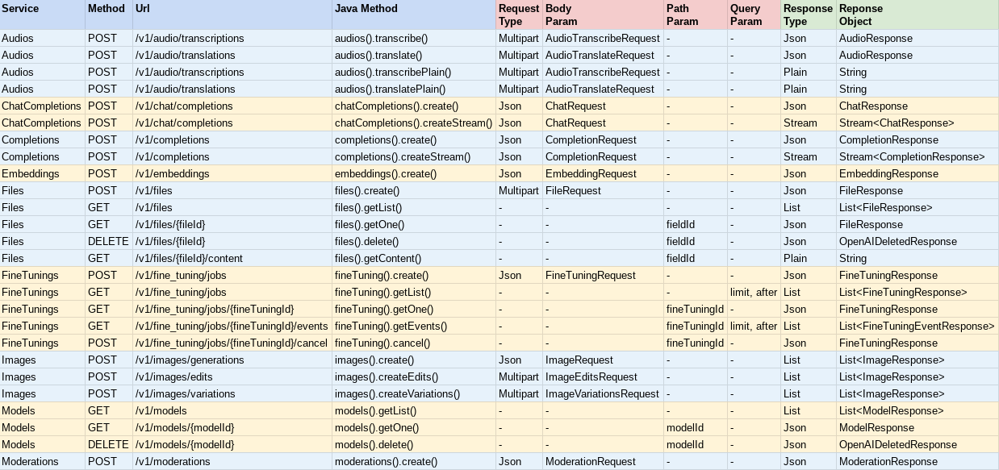
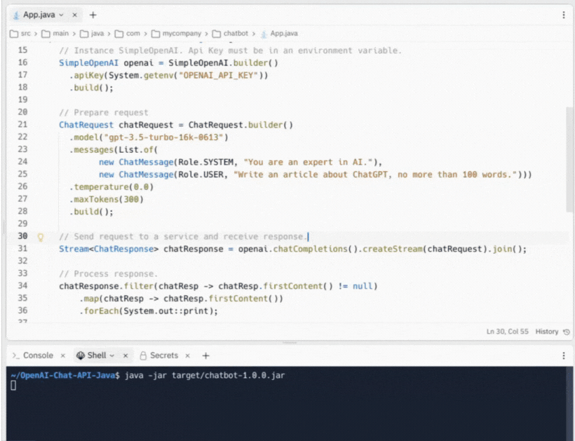

# 📌 Simple-OpenAI
A Java library to use the OpenAI Api in the simplest possible way.


## 💡 Description
Simple-OpenAI is a Java http client library for sending requests to and receiving responses from the [OpenAI Api](https://platform.openai.com/docs/api-reference). It exposes a consistent interface across all the services, yet as simple as you can find in other languages like Python or NodeJs. It's a _community-maintained_ library.

Simple-OpenAI uses the standard Java library [HttpClient](https://docs.oracle.com/en/java/javase/11/docs/api/java.net.http/java/net/http/HttpClient.html) for http communication, [Jackson](https://github.com/FasterXML/jackson) for Json parsing, and [Lombok](https://projectlombok.org/) to minimize boilerplate code.


## ✅ Supported Services
Full support for all of the OpenAI services:



NOTE: All the responses are ```CompletableFuture<ResponseObject>```, which means they are asynchronous, but you can call the join() method to return the result value when complete.


## 🛠️ Installation
You can install Simple-OpenAI by adding the following dependency to your Maven project:

```xml
<dependency>
    <groupId>io.github.sashirestela</groupId>
    <artifactId>simple-openai</artifactId>
    <version>0.2.1</version>
</dependency>
```

Or alternatively using Gradle:

```groovy
dependencies {
    implementation 'io.github.sashirestela:simple-openai:0.2.1'
}
```


## 📘 Usage

### Creating a SimpleOpenAI Object
This is the first step you need to do before to use the services. You must provide at least your _OpenAI Api Key_ ([See here](https://platform.openai.com/docs/api-reference/authentication) for more details). In the following example we are getting the Api Key from an environment variable called ```OPENAI_API_KEY``` which we have created to keep it:
```java
SimpleOpenAI openai = SimpleOpenAI.builder()
    .apiKey(System.getenv("OPENAI_API_KEY"))
    .build();
```
Optionally you could pass your _OpenAI Organization Id_ ([See here](https://platform.openai.com/account/org-settings) for more details) in case you have multiple organizations and you want to identify usage by orgazanization. In the the following example we are getting the Organization Id from an environment variable called ```OPENAI_ORGANIZATION_ID``` which we have created to keep it:
```java
SimpleOpenAI openai = SimpleOpenAI.builder()
    .apiKey(System.getenv("OPENAI_API_KEY"))
    .organizationId(System.getenv("OPENAI_ORGANIZATION_ID"))
    .build();
```
Optionally, as well, you could provide a custom Java HttpClient object if you want to have more options for the http connection, such as executor, proxy, timeout, cookies, etc. ([See here](https://docs.oracle.com/en/java/javase/11/docs/api/java.net.http/java/net/http/HttpClient.Builder.html) for more details). In the following example we are providing a custom HttpClient:
```java
HttpClient httpClient = HttpClient.newBuilder()
    .version(Version.HTTP_1_1)
    .followRedirects(Redirect.NORMAL)
    .connectTimeout(Duration.ofSeconds(20))
    .executor(Executors.newFixedThreadPool(3))
    .proxy(ProxySelector.of(new InetSocketAddress("proxy.example.com", 80)))
    .build();

SimpleOpenAI openai = SimpleOpenAI.builder()
    .apiKey(System.getenv("OPENAI_API_KEY"))
    .httpClient(httpClient)
    .build();
```

### Calling the SimpleOpenAI Services
After you have created a SimpleOpenAI object, you are ready to call its services in order to communicate to OpenAI Api. Let's see some examples.

#### Audio Service
Example to call the Audio service to transcribe an audio to text. We are requesting to receive the transcription in plain text format (see the name of the method):
```java
AudioTranscribeRequest audioRequest = AudioTranscribeRequest.builder()
    .file(Paths.get("hello_audio.mp3"))
    .model("whisper-1")
    .build();
CompletableFuture<String> futureAudio = openai.audios().transcribePlain(audioRequest);
String audioResponse = futureAudio.join();
System.out.println(audioResponse);
```
#### Image Service
Example to call the Image service to generate two images in response to our prompt. We are requesting to receive the images' urls and we are printing out them in the console:
```java
ImageRequest imageRequest = ImageRequest.builder()
    .prompt("A cartoon of a hummingbird that is flying around a flower.")
    .n(2)
    .size(Size.X256)
    .responseFormat(ImageRespFmt.URL)
    .build();
CompletableFuture<List<ImageResponse>> futureImage = openai.images().create(imageRequest);
List<ImageResponse> imageResponse = futureImage.join();
imageResponse.stream().forEach(img -> System.out.println("\n" + img.getUrl()));
```
#### Chat Completion Service
Example to call the Chat Completion service to ask a question and wait for an answer. We are printing out it in the console:
```java
ChatRequest chatRequest = ChatRequest.builder()
    .model("gpt-3.5-turbo-16k-0613")
    .messages(List.of(
        new ChatMessage(Role.SYSTEM, "You are an expert in AI."),
        new ChatMessage(Role.USER, "Write an article about ChatGPT, no more than 100 words.")))
    .temperature(0.0)
    .maxTokens(300)
    .build();
CompletableFuture<ChatResponse> futureChat = openai.chatCompletions().create(chatRequest);
ChatResponse chatResponse = futureChat.join();
System.out.println(chatResponse.firstContent());
```
#### Chat Completion Service with Functions
This funcionality empowers the Chat Completion service to solve specific problems to our context. In this example we are setting three functions and we are entering a prompt that will require to call one of them (the function Product). For setting functions we are using additional classes which implements the interface _Functional_. Those classes define a property by each function argument, annotating them to describe them and each class must override the _execute_ method with function's logic:
```java
public void demoCallChatWithFunctions() {
    FunctionExecutor functionExecutor = new FunctionExecutor();
    functionExecutor.enrollFunction(
        ChatFunction.builder()
            .name("get_weather")
            .description("Get the current weather of a location")
            .functionalClass(Weather.class)
            .build());
    functionExecutor.enrollFunction(
        ChatFunction.builder()
            .name("product")
            .description("Get the product of two numbers")
            .functionalClass(Product.class)
            .build());
    functionExecutor.enrollFunction(
        ChatFunction.builder()
            .name("run_alarm")
            .description("Run an alarm")
            .functionalClass(RunAlarm.class)
            .build());
    List<ChatMessage> messages = new ArrayList<>();
    messages.add(new ChatMessage(Role.USER, "What is the product of 123 and 456?"));
    ChatRequest chatRequest = ChatRequest.builder()
        .model("gpt-3.5-turbo-16k-0613")
        .messages(messages)
        .functions(functionExecutor.getFunctions())
        .functionCall("auto")
        .build();
    CompletableFuture<ChatResponse> futureChat = openai.chatCompletions().create(chatRequest);
    ChatResponse chatResponse = futureChat.join();
    ChatMessage chatMessage = chatResponse.firstMessage();
    Object result = functionExecutor.execute(chatMessage.getFunctionCall());
    messages.add(chatMessage);
    messages.add(
        ChatMessage.builder()
            .role(Role.FUNCTION)
            .content(result.toString())
            .name(chatMessage.getFunctionCall().getName())
            .build());
    chatRequest = ChatRequest.builder()
        .model("gpt-3.5-turbo-16k-0613")
        .messages(messages)
        .functions(functionExecutor.getFunctions())
        .functionCall("auto")
        .build();
    futureChat = openai.chatCompletions().create(chatRequest);
    chatResponse = futureChat.join();
    System.out.println(chatResponse.firstContent());
}

public static class Weather implements Functional {
    @JsonPropertyDescription("City and state, for example: León, Guanajuato")
    public String location;

    @JsonPropertyDescription("The temperature unit, can be 'celsius' or 'fahrenheit'")
    @JsonProperty(required = true)
    public String unit;

    @Override
    public Object execute() {
        return Math.random() * 45;
    }
}

public static class Product implements Functional {
    @JsonPropertyDescription("The multiplicand part of a product")
    @JsonProperty(required = true)
    public double multiplicand;

    @JsonPropertyDescription("The multiplier part of a product")
    @JsonProperty(required = true)
    public double multiplier;

    @Override
    public Object execute() {
        return multiplicand * multiplier;
    }
}

public static class RunAlarm implements Functional {
    @Override
    public Object execute() {
        return "DONE";
    }
}
```


## 🎬 Demo
Demonstration of the Chat functionality in streaming mode. The application prints the information to the console as soon as it is received from the server token by token, in response to our prompt:




## ✳ Run Examples
Examples for each OpenAI service have been created in the folder [demo](https://github.com/sashirestela/simple-openai/tree/main/src/demo/java/io/github/sashirestela/openai/demo) and you can follow the next steps to execute them:
* Clone this respository:
  ```bash
  git clone https://github.com/sashirestela/simple-openai.git
  cd simple-openai
  ```
* Build the project:
  ```bash
  mvn clean install
  ```
* Create an environment variable for your OpenAI Api Key:
  ```bash
  export OPENAI_API_KEY=<here goes your api key>
  ```
* Grant execution permission to the script file:
  ```bash
  chmod +x rundemo.sh
  ```
* Run examples:
  ```bash
  ./rundemo.sh <demo> [debug]
  ```
  Where:

  * ```<demo>``` Is mandatory and must be one of the values:
    * audio
    * chat
    * completion
    * embedding
    * file
    * finetuning
    * image
    * model
    * moderation
  
  * ```[debug]``` Is optional and creates the ```demo.log``` file where you can see log details for each execution.


## 📄 License
Simple-OpenAI is licensed under the MIT License. See the
[LICENSE](https://github.com/sashirestela/simple-openai/blob/main/LICENSE) file
for more information.